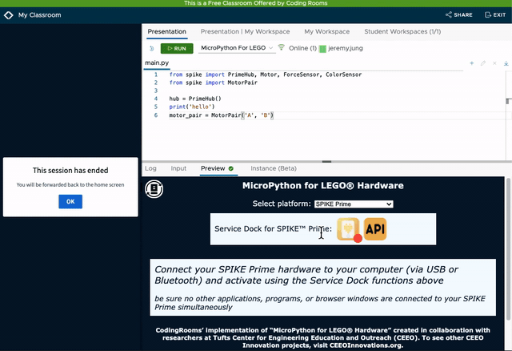

Production: [](https://app.netlify.com/sites/tufts-cr-for-lego/deploys) QA: [](https://app.netlify.com/sites/tufts-cr-for-lego-qa/deploys)

# ***Coding Rooms for LEGO® Hardware***

### LEGO® hardware web execution environment made by Tufts CEEO's Service Dock for use in [Coding Rooms](https://codingrooms.com/)

# About 
> ### Use LEGO® products to teach programming online!
 Supported on ***Google Chrome*** 

Available hardware: SPIKE™ Prime
## Requesting more hardware support
To request more hardware in Coding Rooms please use this [survey.](https://tufts.qualtrics.com/jfe/form/SV_2tM0l0jcPzyPH1z)

# Development

## Testing
( Node js required )
1. Run ``` npm install``` in local repository
2. Change index file directory in test.js to your local directory
3. Run ``` npm test ``` which will open Chromium browser
4. Connect LEGO hardware when prompted
5. Confirm all automated tests have passed in the index page

## File navigation

## ```index.html```
Simulates the interaction between Coding Rooms and the iframe environment. Implementation of Coding Room's ```CCWebExecManager```


## ```iframe.html```
The Service Dock iframe environment. Implementation of Coding Room's ```CCWebExecClient```.


## ```/modules/ServiceDock_SPIKE.js```
LEGO SPIKE™ Prime TuftsCEEO Service (used only in the iframe). Other files in this folder have similar function.

## Current protocol payload (JSON) 
|Parameters   	| Usage   	| Description  	|
|---	          |---	      |---	          |
|language       | string    | language of data sent ("MicroPython for LEGO" when customizing)  	   |
|defaultFileName| string  	      |   	name of the "file"             |
|files   	      | JSON object     |  keys: name of "file", values: string content of file  |
|stdin   	      |   string	      |   	          |

Javascript payload object sent by ```webExecManager``` on ```'execute_code'```
```javascript
        var payload = {
          language: 'demo-lang',
          defaultFileName: fileName,
          files: files,
          stdin: ''
        };

```

# Disclaimer
> CodingRooms’ implementation of “MicroPython for LEGO® Hardware” created in collaboration with researchers at Tufts Center for Engineering Education and Outreach (CEEO). To see other CEEO Innovation projects, visit [CEEO Innovations](http://www.CEEOInnovations.org)

> LEGO®, the LEGO® logo, the Brick, MINDSTORMS®, SPIKE™, and the Minifigure are trademarks of ©The LEGO® Group.
All other trademarks and copyrights are the property of their respective owners. All rights reserved. CodingRooms isn’t affiliated, authorized, or endorsed by The LEGO Group.
